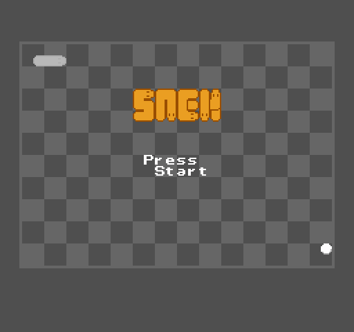
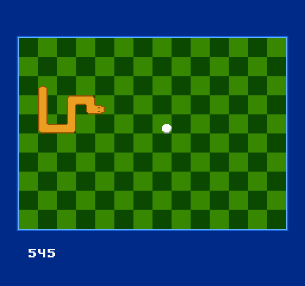

# snek.nes





This ROM fleshes out the snake mechanics from the
[animated background demo rom](https://github.com/zorchenhimer/nes-animated-background).
I'd say it's about 80% finished, but the remaining 20% is mostly polish and
extra features that I don't really want to spend time on.

## Building

Requirements:
- GNU Make
- [cc65](https://github.com/cc65/cc65)
- [Golang](https://go.dev/) (to build go-nes and generate some tables)
- [Aseprite](https://www.aseprite.org/) (optional)

```
$ git clone --recurse-submodules https://github.com/zorchenhimer/nes-snek.git
$ cd nes-snek && make
```

After the above commands you should have `bin/snek.nes`.  This ROM can then be
loaded up in an emulator or dropped on a romcart to run on hardware.

## Food location tables

The food item locations are generated by `rand.go`.  These locations are stored
in two separate talbles: `rand.inc` and `coords.inc`.  The first file,
`rand.inc`, contains RAM address locations for the playfield while `coords.inc`
holds sprite Y/X coordinates.  These two files are included in the repository
to allow for reproducable builds.  Running `make cleanall` will delete these
files, triggering them to be re-generated.  If this is done in error running
the command `git checkout -- *.inc` will restore these files.

## Buttons

Change the snake's direction with the D-pad.  The A and B buttons have no
function.

## Aseprite

The images used were made using Aseprite which a paid program.  The exported
bitmaps have been included in this repository to avoid requiring this program
to build the ROM.  Note that the `make cleanall` command will delete the
bitmaps to trigger re-exporting them using Aseprite.  If this is done in error,
simply use git to restore the images: `git checkout -- images/*.bmp`.
